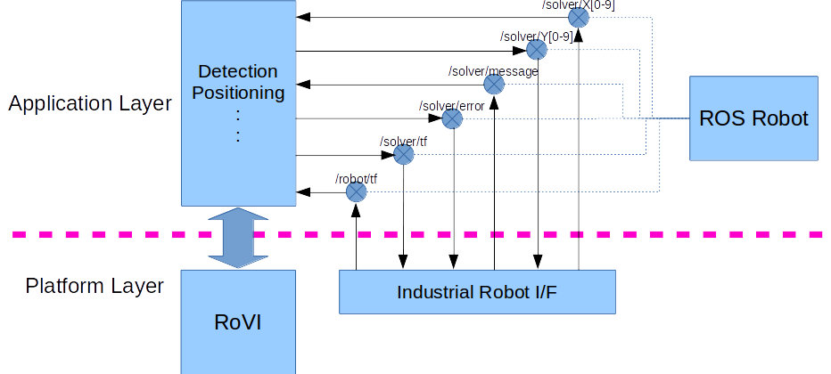

# Application Design Guide Line for RoVI

## Common Structure

## Topics

|Topic|Type|Typical Use|
|:----|:----|:----|
|/solver/X0|std_msgs/Bool|Clear captured data|
|/solver/X1|std_msgs/Bool|Capture|
|/solver/X2|std_msgs/Bool|Solve|
|/solver/X3|std_msgs/Bool|Load...|
|/solver/X4|std_msgs/Bool|Save...|
|/solver/Y[0-9]|std_msgs/Bool|Response for /solver/X[0-9]|
|/solver/message|std_msgs/String|Message|
|/solver/error|std_msgs/String|Error code and message|
|/solver/tf|geometry_msgs/Transform|Rigid transform solved|
|/robot/tf|geometry_msgs/Transform|Current transform of robot(base=0,tool=0)|

## Parameters
|Parameter|Description|
|:----|:----|
|/robot/mTc|Calibrated transform(hand eye)|
|/robot/bTc|Calibrated transform(fixed)|

