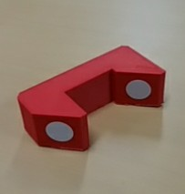
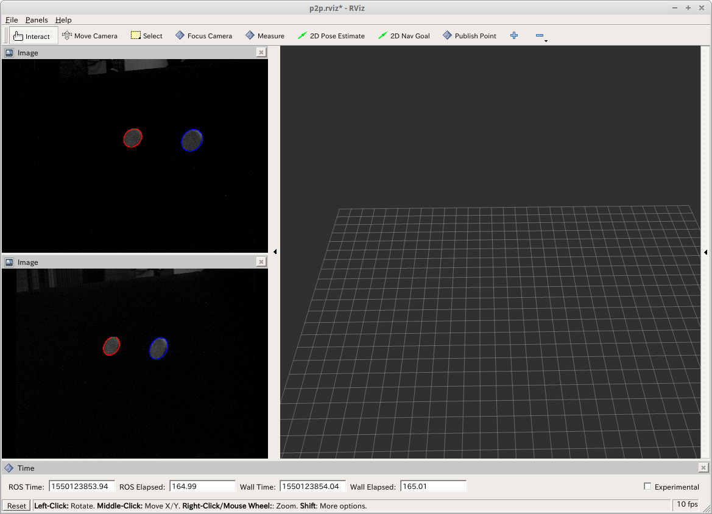

# 計測精度評価ツール

## 治具の準備

基準面の寸法精度が1/100mm以下の精密治具を用意しましょう。
  
治具の計測基準となる２面に白のマーカを貼ります(ダイソーのでよい)。
このマーカが検出されやすいよう、治具は黒のつや消しなどの表面仕上げとする。

## 起動

RoVIの起動後、以下を起動します。
~~~
roscd rovi/QC/p2p
roslaunch p2p.launch
~~~

## 調整

ソフトウェアはリアルタイムに○を検出します。○が検出されると、下図のように赤または青にてエッジがハイライトされます。左右カメラで治具に貼り付けられた２つの○が検出されるよう、頑張ってみましょう。
  

## 計測

○が検出されている状態で、点群撮像を行う
~~~
rosservice call /rovi/pshift_genpc
~~~
と、点群から○にフィットする２平面を求め、この距離を算出します。結果はトピック/p2p/distに出力されます。見たいときは以下のように待ち構えておきましょう。
~~~
rostopic echo /p2p/dist
~~~

