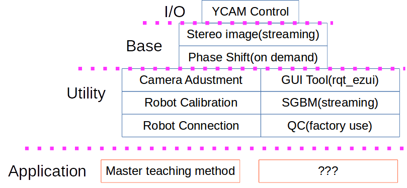

# RoVIについて

RoVIは3Dビジョンセンサーを組み込んだロボットのアプリケーションを開発するための、ソフトウェア群を提供します。
## 構成
下図にRoVIのソフトウェア構成を示します。コア部(I/O,Base)とUtilityをプラットフォーム層として、これを利用し用途に合わせてApplicationを開発します。基本的な機能はプラットフォーム層を利用できるので、アプリケーションの開発L/Tが短縮出来ます。  
またApplication実装例として、MTM(Master Teaching Method)パッケージも公開予定です(https://github.com/YOODS/MTM)。
<!--
comment out 2020/08/21 image file is not found.

-->

## このRepositoryについて  
このRepositoryはYOODS社が提供するYCAM3Dを制御するソフトウェアです。

## ツール・ライブラリの追加  
以下のソフトウェアが未だインストールされていなければ追加します。
### ビルド環境
  - g++
  - git
  - automake
  - intltool
  - libgsreamer*-dev
~~~
sudo apt install g++ git automake intltool libgstreamer*-dev
~~~

### Nodejs  
Node8以上。以下はNode9のインストール方法です。
~~~
cd ~
curl -sL https://deb.nodesource.com/setup_9.x | sudo -E bash -
sudo apt-get install nodejs
~~~

### Pythonパッケージャ  
pipがなければまずpipをインストール
~~~
sudo apt install python-pip python-dev
~~~
pipのversionは9.0.1以上が必要になる。低い場合はアップデートする。
~~~
pip install pip==9.0.3 --user
~~~

### ROSアカウントの初期設定  
.bashrcの最後に以下を入れる(Linux環境。Winは違うかも・・・)
~~~
source /opt/ros/noetic/setup.bash
source ~/catkin_ws/devel/setup.bash
export ROS_HOSTNAME=localhost
export ROS_MASTER_URI=http://localhost:11311
export NODE_PATH=/usr/lib/node_modules
export PYTHONPATH=/usr/local/lib/python2.7/dist-packages:$PYTHONPATH
~~~
反映させるため、一旦ターミナルを閉じ、新しいターミナルを開く。

## RoVIのインストール  

ROSのソースディレクトリ(~/catkin_ws/srcなど)に、israfelブランチをcheckoutします。
~~~
git clone -b israfel --depth 1 https://github.com/YOODS/rovi.git
~~~
GetingStarted.mdに記載のとおりです。この記載内容をInstall.shにて一括処理することも可能です(歓迎スクリプトの間違い指摘)。
~~~
cd rovi
./Install.sh
~~~

## 起動

1. SXGAモード  
~~~
roslaunch rovi ycam3sxga.launch
~~~

2. VGAモード  
~~~
roslaunch rovi ycam3vga.launch
~~~
長さの単位をmmとする場合は以下のlaunchを使います。

3. SXGAモード(mm単位)  
~~~
roslaunch rovi ycam3sxga_mm.launch
~~~

4. VGAモード(mm単位)  
~~~
roslaunch rovi ycam3vga_mm.launch
~~~

## Topics
### To publish
<table>
<tr><th>Name<th>Type<th>Description
<tr><td>/rovi/ps_floats<td>Numpy<td>3DデータNumpy形式
<tr><td>/rovi/ps_pc<td>PointCloud<td>3DデータPointCloud形式
<tr><td>/rovi/left/image_raw<td>Image<td>左カメラraw画像
<tr><td>/rovi/left/image_rect<td>Image<td>左カメラrectify画像
<tr><td>/rovi/left/image_rect0<td>Image<td>左カメラrectify画像(ストロボOFF)
<tr><td>/rovi/right/image_raw<td>Image<td>右カメラraw画像
<tr><td>/rovi/right/image_rect<td>Image<td>右カメラrectify画像
<tr><td>/rovi/right/image_rect0<td>Image<td>右カメラrectify画像(ストロボOFF)
<tr><td>/error<td>String<td>Errorログ
<tr><td>/rovi/stat<td>Bool<td>接続状態
<tr><td>/rovi/Y1<td>Bool<td>撮像結果(X1に対するレスポンス)
</table>

### To subscribe
<table>
<tr><th>Name<th>Type<th>Description
<tr><td>/rovi/X1<td>Bool<td>撮像トリガ
</table>

### Parameters

#### Yaml file
<table>
<tr><th>Name<th>Description
<tr><td>ycam3vga.yaml<td>VGAモードパラメータファイル
<tr><td>ycam3sxga.yaml<td>SXGAモードパラメータファイル
<tr><td>param.yaml<td>オーバライドパラメータファイル
</table>

#### List
<table>
<tr><th>Name<th>Description<td>Type<td>Range
<tr><td>/rovi/camera/Acquire<td><td><td>
<tr><td>/rovi/camera/AcquisitionFrameRate<td><td><td>
<tr><td>/rovi/camera/AcquisitionMode<td><td><td>
<tr><td>/rovi/camera/ExposureAuto<td><td><td>
<tr><td>/rovi/camera/ExposureTimeAbs<td>カメラ露光時間<td><td>
<tr><td>/rovi/camera/FocusPos<td><td><td>
<tr><td>/rovi/camera/Gain<td>カメラゲイン<td><td>
<tr><td>/rovi/camera/GainAuto<td><td><td>
<tr><td>/rovi/camera/Height<td>カメラ解像度(高さ)<td><td>
<tr><td>/rovi/camera/ID<td><td><td>
<tr><td>/rovi/camera/MTU<td><td><td>
<tr><td>/rovi/camera/TriggerMode<td><td><td>
<tr><td>/rovi/camera/TriggerSource<td><td><td>
<tr><td>/rovi/camera/Width<td>カメラ解像度(高さ)<td><td>
<tr><td>/rovi/camera/address<td>YCAMのIPアドレス<td>string<td>
<tr><td>/rovi/camera/frame_id<td><td><td>
<tr><td>/rovi/camera/guid<td><td><td>
<tr><td>/rovi/camera/image_raw/compressed/format<td><td><td>
<tr><td>/rovi/camera/image_raw/compressed/jpeg_quality<td><td><td>
<tr><td>/rovi/camera/image_raw/compressed/png_level<td><td><td>
<tr><td>/rovi/camera/image_raw/compressedDepth/depth_max<td><td><td>
<tr><td>/rovi/camera/image_raw/compressedDepth/depth_quantization<td><td><td>
<tr><td>/rovi/camera/image_raw/compressedDepth/png_level<td><td><td>
<tr><td>/rovi/camera/image_raw/theora/keyframe_frequency<td><td><td>
<tr><td>/rovi/camera/image_raw/theora/optimize_for<td><td><td>
<tr><td>/rovi/camera/image_raw/theora/quality<td><td><td>
<tr><td>/rovi/camera/image_raw/theora/target_bitrate<td><td><td>
<tr><td>/rovi/camera/major_version<td>YCAMのメジャーバージョン番号<td>int<td>
<tr><td>/rovi/camera/minor_version<td>YCAMのマイナーバージョン番号<td>int<td>
<tr><td>/rovi/camera/mtu<td><td><td>
<tr><td>/rovi/camera/serial_no<td>YCAMのシリアル番号<td>string<td>
<tr><td>/rovi/camera/shmem<td><td><td>
<tr><td>/rovi/camera/softwaretriggerrate<td><td><td>
<tr><td>/rovi/genpc/Q<td>Qマトリクス<td>float[16]<td>
<tr><td>/rovi/genpc/dump<td>点群データ出力先<td>string<td>
<tr><td>/rovi/left/genpc/D<td>左カメラキャリブレーション結果。Dマトリクス<td>float[5]<td>
<tr><td>/rovi/left/genpc/D_Cols<td>左カメラキャリブレーション結果。Dマトリクス列数<td>int<td>
<tr><td>/rovi/left/genpc/D_Rows<td>左カメラキャリブレーション結果。Dマトリクス行数<td>int<td>
<tr><td>/rovi/left/genpc/Height<td>左カメラ解像度(高さ)<td>int<td>
<tr><td>/rovi/left/genpc/K<td>左カメラキャリブレーション結果。Kマトリクス<td>float[9]<td>
<tr><td>/rovi/left/genpc/K_Cols<td>左カメラキャリブレーション結果。Kマトリクス列数<td>int<td>
<tr><td>/rovi/left/genpc/K_Rows<td>左カメラキャリブレーション結果。Kマトリクス行数<td>int<td>
<tr><td>/rovi/left/genpc/R<td>左カメラキャリブレーション結果。Rマトリクス<td>float[9]<td>
<tr><td>/rovi/left/genpc/R_Cols<td>左カメラキャリブレーション結果。R行列マトリクス列数<td>int<td>
<tr><td>/rovi/left/genpc/R_Rows<td>左カメラキャリブレーション結果。R行列マトリクス行数<td>int<td>
<tr><td>/rovi/left/genpc/T<td>左カメラキャリブレーション結果。Tマトリクス<td>float[9]<td>
<tr><td>/rovi/left/genpc/T_Cols<td>左カメラキャリブレーション結果。Tマトリクス列数<td>int<td>
<tr><td>/rovi/left/genpc/T_Rows<td>左カメラキャリブレーション結果。Tマトリクス行数<td>int<td>
<tr><td>/rovi/left/genpc/Width<td>左カメラ解像度(幅)<td>int<td>
<tr><td>/rovi/left/remap/D<td>左カメラDマトリクス<td>float[5]<td>
<tr><td>/rovi/left/remap/K<td>左カメラKマトリクス<td>float[9]<td>
<tr><td>/rovi/left/remap/Kn<td>PマトリクスからdecomposeしたKマトリクス。remap_nodeが算出<td>float[9]<td>
<tr><td>/rovi/left/remap/P<td>左カメラPマトリクス<td>float[12]<td>
<tr><td>/rovi/left/remap/R<td>マトリクス<td>float[9]<td>
<tr><td>/rovi/left/remap/height<td>イメージの高さ<td>int<td>
<tr><td>/rovi/left/remap/width<td>イメージの幅<td>int<td>
<tr><td>/rovi/live/camera/AcquisitionFrameRate<td>フレームレート<td>int<td>
<tr><td>/rovi/live/camera/ExposureTime<td>露光時間(&micro;s)<td>int<td>
<tr><td>/rovi/live/camera/Gain<td>カメラゲイン<td>int<td>
<tr><td>/rovi/live/camera/GainAnalog<td>アナログゲイン<td>int<td>
<tr><td>/rovi/live/camera/SoftwareTriggerRate<td>ストリーミング時フレームレート<td>int<td>
<tr><td>/rovi/pshift_genpc/calc/brightness<td>ハレーション閾値<td>int<td>
<tr><td>/rovi/pshift_genpc/calc/bw_diff<td>白/黒画像の最小差<td>int<td>
<tr><td>/rovi/pshift_genpc/calc/camera_type<td>カメラタイプ(0: stereo, 1: hmat, 2: cam_param)(但し、0は廃止)<td>int<td>0-2
<tr><td>/rovi/pshift_genpc/calc/darkness<td>点群を出力しない黒の閾値<td>int<td>
<tr><td>/rovi/pshift_genpc/calc/gcode_variation<td>一周期分の区間に含まれるグレイコードの種類数<td>int<td>
<tr><td>/rovi/pshift_genpc/calc/image_height<td>イメージの高さ<td>int<td>
<tr><td>/rovi/pshift_genpc/calc/image_width<td>イメージの幅<td>int<td>
<tr><td>/rovi/pshift_genpc/calc/interpolation<td>補完機能有効=1,無効=0<td>int<td>0,1
<tr><td>/rovi/pshift_genpc/calc/ls_points<td>視差計算時の最小二乗法サンプル数.3 or 5<td>int<td>3,5
<tr><td>/rovi/pshift_genpc/calc/max_parallax<td>近い側最大視差[pixel](30万画素の場合半分にすること)<td>double<td>
<tr><td>/rovi/pshift_genpc/calc/max_ph_diff<td>滑らかさ(小さく厳しくすると穴が増える)<td>double<td>
<tr><td>/rovi/pshift_genpc/calc/method3d<td>三次元座標計算手法の選択(0: Qマトリクス方式, 1:視線ベクトル方式, 2:P行列方式)<td>int<td>0-2
<tr><td>/rovi/pshift_genpc/calc/min_parallax<td>遠い側最大視差[pixel](30万画素の場合半分にすること)<td>double<td>
<tr><td>/rovi/pshift_genpc/calc/phase_wd_min<td>画像内での一周期分の幅の最小値[pixel]<td>int<td>
<tr><td>/rovi/pshift_genpc/calc/phase_wd_thr<td>一周期分の幅がこの値以下であれば、その区間での位相は復号されない(三次元計算されない)。この値はphase_wd_minよりも大きくしないでください<td>int<td>
<tr><td>/rovi/pshift_genpc/camera/ExposureTime<td>位相シフト時露光時間(&micro;s)<td>int<td>
<tr><td>/rovi/pshift_genpc/camera/Gain<td>位相シフト時カメラゲイン<td>int<td>
<tr><td>/rovi/pshift_genpc/projector/ExposureTime<td>発光時間(ms)<td>int<td>
<tr><td>/rovi/pshift_genpc/projector/Intensity<td>発光強度<td>byte<td>
<tr><td>/rovi/pshift_genpc/projector/Interval<td>発光間隔(ms)<td>int<td>
<tr><td>/rovi/right/genpc/D<td>右カメラキャリブレーション結果。Dマトリクス<td>float[5]<td>
<tr><td>/rovi/right/genpc/D_Cols<td>右カメラキャリブレーション結果。Dマトリクス列数<td>int<td>
<tr><td>/rovi/right/genpc/D_Rows<td>右カメラキャリブレーション結果。Dマトリクス行数<td>int<td>
<tr><td>/rovi/right/genpc/Height<td>右カメラ解像度(高さ)<td>int<td>
<tr><td>/rovi/right/genpc/K<td>右カメラキャリブレーション結果。Kマトリクス<td>float[9]<td>
<tr><td>/rovi/right/genpc/K_Cols<td>右カメラキャリブレーション結果。Kマトリクス列数<td>int<td>
<tr><td>/rovi/right/genpc/K_Rows<td>右カメラキャリブレーション結果。Kマトリクス行数<td>int<td>
<tr><td>/rovi/right/genpc/R<td>右カメラキャリブレーション結果。Rマトリクス<td>float[9]<td>
<tr><td>/rovi/right/genpc/R_Cols<td>右カメラキャリブレーション結果。R行列マトリクス列数<td>int<td>
<tr><td>/rovi/right/genpc/R_Rows<td>右カメラキャリブレーション結果。R行列マトリクス行数<td>int<td>
<tr><td>/rovi/right/genpc/T<td>右カメラキャリブレーション結果。Tマトリクス<td>float[9]<td>
<tr><td>/rovi/right/genpc/T_Cols<td>右カメラキャリブレーション結果。Tマトリクス列数<td>int<td>
<tr><td>/rovi/right/genpc/T_Rows<td>右カメラキャリブレーション結果。Tマトリクス行数<td>int<td>
<tr><td>/rovi/right/genpc/Width<td>右カメラ解像度(幅)<td>int<td>
<tr><td>/rovi/right/remap/D<td>右カメラDマトリクス<td>float[5]<td>
<tr><td>/rovi/right/remap/K<td>右カメラKマトリクス<td>float[9]<td>
<tr><td>/rovi/right/remap/Kn<td>PマトリクスからdecomposeしたKマトリクス。remap_nodeが算出<td>float[5]<td>
<tr><td>/rovi/right/remap/P<td>右カメラPマトリクス<td>float[12]<td>
<tr><td>/rovi/right/remap/R<td>右カメラRマトリクス<td>float[9]<td>
<tr><td>/rovi/right/remap/height<td>イメージの高さ<td>int<td>
<tr><td>/rovi/right/remap/width<td>イメージの幅<td>int<td>
</table>

## ドキュメントリスト  
|ドキュメント名|コンテンツ|
|:----|:----|
|[GettingStarted.md](GettingStarted.md)|インストール手順についての記載|
|[GettingStarted-TX2.md](GettingStarted-TX2.md)|Jetson-TX2用インストール手順|
|[AppDesign.md](AppDesign.md)|roviを利用したアプリケーションの設計について|
|[CameraDriver.md](CameraDriver.md)|カメラドライバーインタフェースについて|
|[TopicsDetail.md](TopicsDetail.md)|トピック詳細|

## 動作確認済み環境  
|OS|Desktop|ROS|STATUS|
|:----|:----|:----|:----|
|Ubuntu 20.04(focal fossa)|GNOME|noetic|OK|
